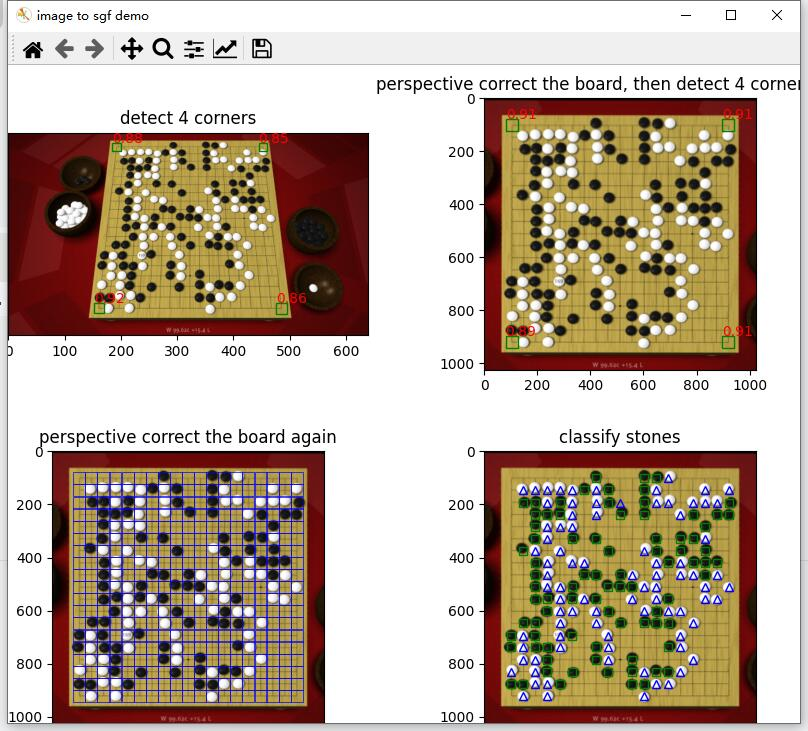
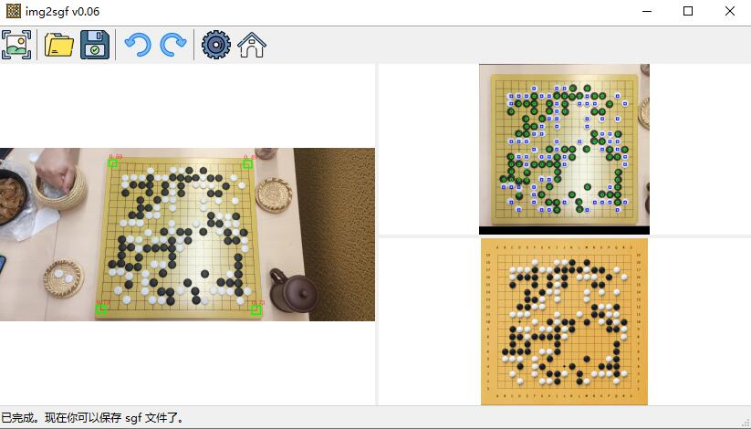
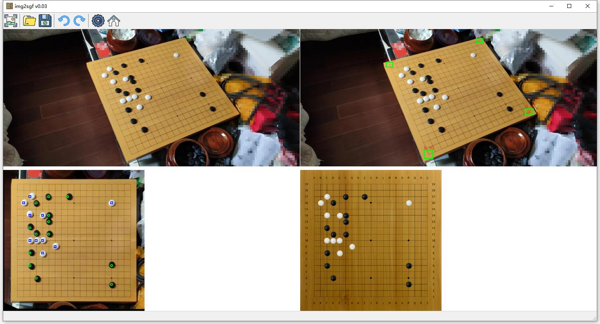

# Dependencies
[python](https://www.python.org/) >= 3.6

[PyTorch](https://pytorch.org/)

[torchvision](https://pytorch.org/vision/stable/index.html)

[cv2](https://github.com/opencv/opencv-python)

[numpy](https://numpy.org/)

[matplotlib](https://matplotlib.org/)

[pillow](https://pillow.readthedocs.io/en/stable/)

[sgfmill](https://github.com/mattheww/sgfmill)

[pyautogui](https://pypi.org/project/PyAutoGUI/)

for GUI [wxPython](https://www.wxpython.org/)


# Usage:
Download and extract pth files from https://github.com/noword/image2sgf/releases

```
usage: img2sgf.py [-h] [--sgf_name SGF_NAME] [--capture] [--save_images] [image_name]

positional arguments:
  image_name           input image file name

optional arguments:
  -h, --help           show this help message and exit
  --sgf_name SGF_NAME  output sgf file name
  --capture            capture the screenshot
  --save_images        save grid images
  ```


# Examples:

`img2sgf.py examples\goban.png`


# GUI
```img2sgf_gui.pyw```




